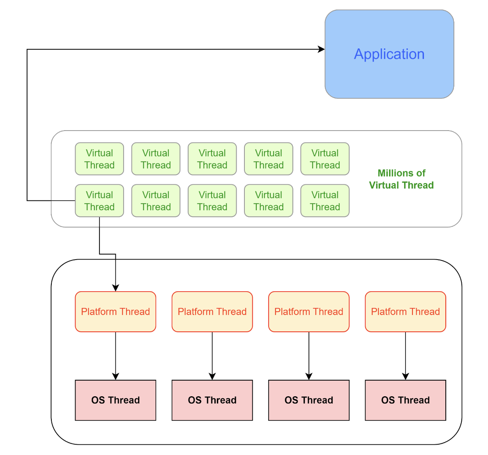

There are 3 ways to create new thread : (Example [ThreadCreation.java](ThreadCreation.java))
1. By Extending ``` Thread ``` class
2. By Implementing ``` Runnable ``` interface
3. By Implementing ``` Callable ``` interface (Can't submit callable task directly to thread. Need to wrap it with ``` FutureTask<ReturnType>```)

Ways to create Virtual thread :
1. Using ```Thread``` class only Thread. 
   1. ``` Thread.ofVirtual().start(Runnable Task)```
   2. ```Thread.startVirtualThread(Runnable Task)```


Benefits of Virtual threads :
1. Improve application availability
2. Improve application throughput
3. Reduce ```OutOfMemoryException - Unable to create new native thread```
4. Reduce application memory consumption as it takes very less memory for running and context switching
5. Improve code quality
6. 100% compatible with platform thread




